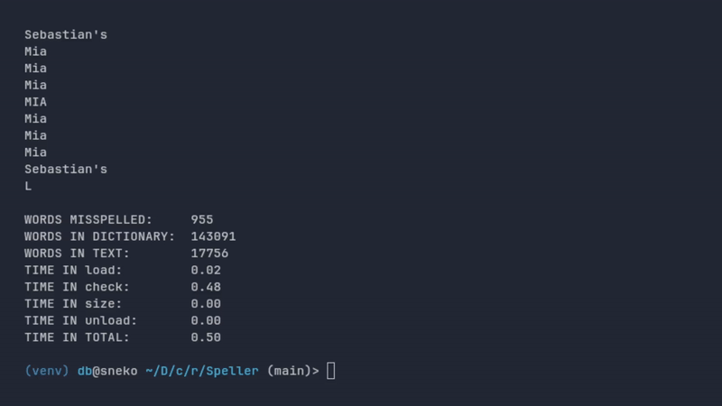

# Meus Problem Sets do CS50x

Este é um pequeno repositório para eu poder apresentar minhas lições do curso introdutório a ciência da computação da Harvard, CS50x. Apresentando o nome, a descrição e as habilidades desenvolvidas.

## DNA

Uma aplicação que lê um arquivo csv contendo dados de DNA de várias pessoas, e um arquivo .txt de uma sequência genética procurando STRs (repetições curtas em tandem) para identificar qual sequência genética é de quem.

### Habilidades desenvolvidas

Python, Processamento de dados, Algorítimos, File I/O (Entrada e Saída de Arquivos)

### demo

GIF

## Filter

Uma aplicação de terminal escrita em C que aplica filtros à imagems .bmp como desfoque, sépia, grayscale e reverso da escolha do usuário.

### Habilidades desenvolvidas

C, Algorítimos, 2D Arrays (Matrizes)

### demo

GIF

## Finance

Um site de compra e venda de ações onde o usuário pode criar ou entrar numa conta existente para comprar e vender ações de sua escolha, podendo também ver o preço de cada ação mudando em tempo real.

### Habilidades desenvolvidas

Python, Flask, SQL, APIs, HTML

### demo

GIF

## Movies

Comandos para interagir com o banco de dados do [IMDb](https://www.imdb.com/).

### Habilidades desenvolvidas

SQL, Banco de dados Relacionais

## Speller

Uma aplicação onde o usuário escolhe um dicionário e um arquivo de texto para checar erros de ortografia, também constando a quantidade de: palavras erradas, palavras no dicionário, palavras no texto e algumas informações para debug.

### Habilidades desenvolvidas

C, Estrutura de Dados, Gerenciamento de Memória

### demo

    

  

  