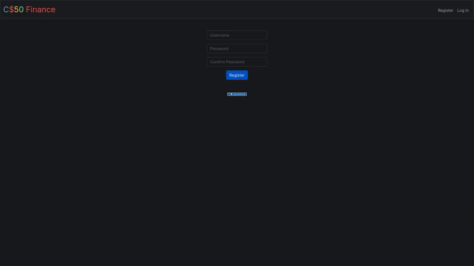
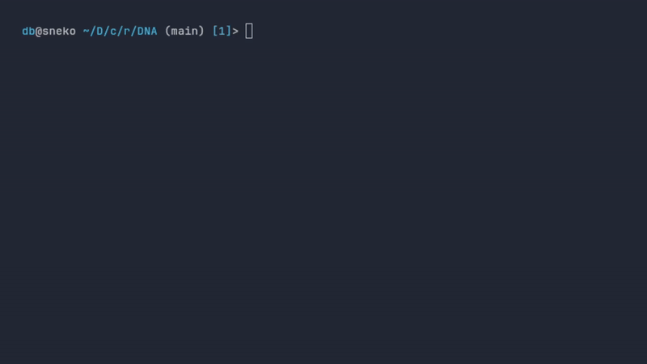
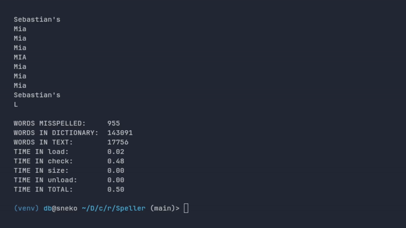
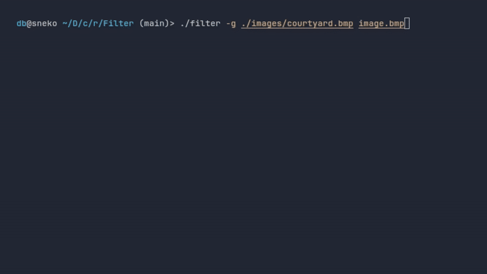

# 🎓 Harvard CS50x: Computer Science Highlights

> Uma coleção de desafios (Problem Sets) selecionados do curso de introdução à Ciência da Computação da Universidade de Harvard.

## 🎯 Sobre o Repositório
Este repositório reúne os projetos mais desafiadores que realizei durante o CS50x. Cada pasta contém a implementação de soluções que cobrem desde a gestão de memória em baixo nível (C) até o desenvolvimento de aplicações web modernas (Flask/SQL).

---

## 🚀 Projetos em Destaque

### 🏛 CS50 Finance (Fullstack Web)
Um simulador de bolsa de valores onde usuários podem "comprar" e "vender" ações reais utilizando a API da IEX.
- **Habilidades:** Python, Flask, SQL (SQLite), Integração de APIs, Autenticação de Usuários, HTML/CSS.
- **Destaque:** Implementação de lógica de banco de dados para histórico de transações e saldo em tempo real.

  

---

### 🧬 DNA (Data Science / Algorithms)
Aplicação de análise genética que identifica indivíduos a partir de sequências de DNA (STRs).
- **Habilidades:** Python, Processamento de Dados (CSV), Algoritmos de busca de padrões, File I/O.
- **Destaque:** Uso eficiente de dicionários e manipulação de strings para processar grandes volumes de dados genéticos.

  

---

### 🔤 Speller (Data Structures)
Um corretor ortográfico de alta performance que carrega um dicionário inteiro na memória para validar arquivos de texto.
- **Habilidades:** C, Estruturas de Dados (Hash Tables), Gerenciamento de Memória (Malloc/Free), Ponteiros.
- **Destaque:** Foco em otimização de tempo de execução e uso eficiente de memória, minimizando o "leak" de memória.

  

---

### 📸 Filter (Image Processing)
Software de terminal para aplicação de filtros digitais em imagens `.bmp`.
- **Habilidades:** C, Algoritmos de manipulação de pixels, Matrizes 2D.
- **Destaque:** Implementação manual de algoritmos de Blur (Box Blur) e detecção de bordas.

  

---

### 🎬 Movies (Relational Databases)
Conjunto de consultas complexas para extrair informações do banco de dados do IMDb.
- **Habilidades:** SQL, Modelagem de dados, Relacionamentos Many-to-Many, Joins complexos.
- **Destaque:** Otimização de queries para buscar dados cruzados entre milhares de registros de atores e filmes.

---

## 🧠 Principais Aprendizados Técnicos
Ao concluir estes desafios, consolidei conhecimentos em:
- **Gerenciamento de Memória:** Alocação dinâmica e prevenção de memory leaks em C.
- **Complexidade de Algoritmos:** Entendimento de Notação Big O (Tempo e Espaço).
- **Estruturas de Dados:** Implementação de Linked Lists, Hash Tables e Tries.
- **Segurança Web:** Prevenção de SQL Injection e gestão de sessões.

## 🛠 Como navegar
Cada projeto está em sua respectiva pasta. Para executar os projetos em C, utilize o compilador `gcc` ou `make`. Para os projetos em Python, certifique-se de ter as dependências listadas no arquivo `requirements.txt`.

---
Produzido durante a jornada no [CS50x da Harvard University](https://cs50.harvard.edu/x/).
